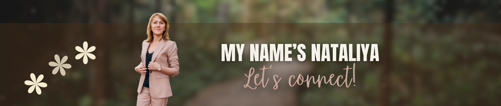

## Hi there 👋 &nbsp; Welcome to my profile!

Hello! My name is **Nataliya Kuznetsov** - I’m currently studying for an **A.A.S. in Computer Science** at *Columbus State Community College* 🏫.  

I’m deeply interested in **data**, **coding**, and the creative ways technology can make everyday life better.  
Right now, I’m focusing on **Python** and **Git**, and I love participating in communities and competitions that encourage innovation and collaboration.  

### 🧰 Tools:

🔭 I’m currently working on this page. 

🌱 I’m currently learning python 3. 

📫 How to reach me:

⚡ Fun fact: I can write with **both hands at the same time** ✍️  

⭐️ *Thanks for visiting - feel free to connect or collaborate!*

